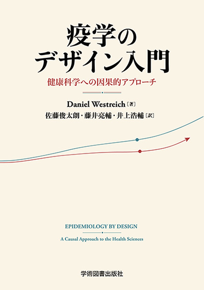
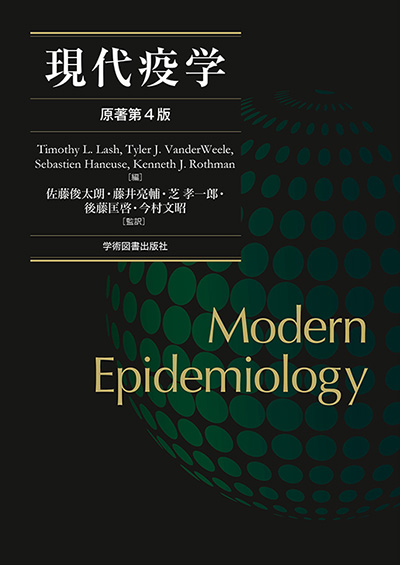

## Articles {#selected-publications}

### Original Articles, First Author {#first-author}

::: {.pub-list}
::: {#pub-40226163 .pub-item}

Estimation of the adjusted risk difference for very rare events, large samples, and extreme exposure frequency: Application of Vaccine Effectiveness, Networking, and Universal Safety study data

Sato S, Kawazoe Y, Murata F, Maeda M, Fukuda H

Ann Clin Epidemiol. 2025;7(2):50-60.

::: {.pub-actions}
[PubMed](https://pubmed.ncbi.nlm.nih.gov/40226163/)
[DOI](https://doi.org/10.37737/ace.25007)
:::
:::
::: {#pub-38282861 .pub-item}

Comparison design and evaluation power in cohort and self-controlled case series designs for post-authorization vaccine safety studies

Sato S, Kawazoe Y, Katsuta T, Fukuda H

PeerJ. 2024;12:e16780.

::: {.pub-actions}
[PubMed](https://pubmed.ncbi.nlm.nih.gov/38282861/)
[DOI](https://doi.org/10.7717/peerj.16780)
:::
:::
::: {#pub-38044244 .pub-item}

Immune thrombocytopenic purpura and Guillain-Barré syndrome after 23-valent pneumococcal polysaccharide vaccination in Japan: The vaccine effectiveness, networking, and universal safety (VENUS) study

Sato S, Katsuta T, Kawazoe Y, Takahashi M, Murata F, Maeda M, Fukuda H, Kamidani S

Vaccine. 2024;42(1):4-7.

::: {.pub-actions}
[PubMed](https://pubmed.ncbi.nlm.nih.gov/38044244/)
[DOI](https://doi.org/10.1016/j.vaccine.2023.11.053)
:::
:::
::: {#pub-29975732 .pub-item}

Fast score test with global null estimation regardless of missing genotypes

Sato S, Ueki M; Alzheimer's Disease Neuroimaging Initiative

PLOS ONE. 2018;13(7):e0199692.

::: {.pub-actions}
[PubMed](https://pubmed.ncbi.nlm.nih.gov/29975732/)
[DOI](https://doi.org/10.1371/journal.pone.0199692)
:::
:::
:::

### Original Articles, Co-first Author {#co-first-author}

::: {.pub-list}
::: {#pub-41174486 .pub-item}

A novel scoring algorithm for chest pain can effectively support the diagnosis of acute coronary syndrome in prehospital settings: a cross-sectional study

Iyama K, Sato S, Akashi R, Baba K, Hayakawa K, Ikeda S, Maemura K, Tasaki O

Int J Emerg Med. 2025 Oct 31;18(1):224.

::: {.pub-actions}
[PubMed](https://pubmed.ncbi.nlm.nih.gov/41174486/)
[DOI](https://doi.org/10.1186/s12245-025-01019-7)
:::
:::
::: {#pub-37234205 .pub-item}

Decreased community-acquired pneumonia coincided with rising awareness of precautions before governmental containment policy in Japan

Tashiro M, Sato S, Endo A, Hamashima R, Ito Y, Ashizawa N, Takeda K, Iwanaga N, Ide S, Fujita A, Takazono T, Yamamoto K, Tanaka T, Furumoto A, Yanagihara K, Mukae H, Fushimi K, Izumikawa K

PNAS Nexus. 2023;2(5):pgad153.

::: {.pub-actions}
[PubMed](https://pubmed.ncbi.nlm.nih.gov/37234205/)
[DOI](https://doi.org/10.1093/pnasnexus/pgad153)
:::
:::
::: {#pub-33025889 .pub-item}

Next-generation sequencing of the whole MEFV gene in Japanese patients with familial Mediterranean fever: a case-control association study

Koga T, Sato S, Mishima H, Migita K, Endo Y, Umeda M, Sumiyoshi R, Nonaka F, Fukui S, Kawashiri SY, Iwamoto N, Ichinose K, Tamai M, Nakamura H, Origuchi T, Ueki Y, Masumoto J, Agematsu K, Yachie A, Yoshiura KI, Eguchi K, Kawakami A

Clin Exp Rheumatol. 2020;38 Suppl 127(5):35-41.

::: {.pub-actions}
[PubMed](https://pubmed.ncbi.nlm.nih.gov/33025889/)
:::
:::
::: {#pub-31518984 .pub-item}

Impact of perioperative aneurysm rebleeding after subarachnoid hemorrhage

Horie N, Sato S, Kaminogo M, Morofuji Y, Izumo T, Anda T, Matsuo T

J Neurosurg. 2019 Sep 13:1-10.

::: {.pub-actions}
[PubMed](https://pubmed.ncbi.nlm.nih.gov/31518984/)
[DOI](https://doi.org/10.3171/2019.6.JNS19704)
:::
:::
:::

### Recent Publications from PubMed {#recent-publications}

PubMed data updated: 2026-09-13 / 178 records found

::: {.pub-list}
::: {#recent-pub-42699223 .pub-item}

Respiratory Support With Nasal High Flow Reduces Opioid Requirements During Endoscopic Retrograde Cholangiopancreatography

Mori T, Ayuse T, Sato S, Ichinomia T, Yano R, Shimakura A, Nakao Y, Takahashi K, et al.

DEN Open. 2026. 7(1). e70421.

::: {.pub-actions}
[PubMed](https://pubmed.ncbi.nlm.nih.gov/42699223/)
[DOI](https://doi.org/10.1002/deo2.70421)
:::
:::
::: {#recent-pub-42578996 .pub-item}

Ultra-early versus early adjunctive vasopressin initiation after norepinephrine escalation in septic shock: a target trial emulation

Nakashima T, Ichinomiya T, Nakajima M, Shinozaki T, Shibata J, Goto T, Sato S, Hara T

Intensive Care Med. 2026.

::: {.pub-actions}
[PubMed](https://pubmed.ncbi.nlm.nih.gov/42578996/)
[DOI](https://doi.org/10.1007/s00134-026-08575-3)
:::
:::
::: {#recent-pub-42380033 .pub-item}

Predicting Nonrecovery of Muscle Strength in Critically Ill Patients with Intensive Care Unit-Acquired Weakness

Nagura H, Oikawa M, Hanada M, Yano Y, Watanabe T, Tanaka Y, Takeuchi R, Sato S, et al.

Am J Crit Care. 2026. 35(4). 276-285.

::: {.pub-actions}
[PubMed](https://pubmed.ncbi.nlm.nih.gov/42380033/)
[DOI](https://doi.org/10.4037/ajcc2026710)
:::
:::
::: {#recent-pub-42315267 .pub-item}

AMI-SSS01 portable phonocardiographic examination with AI-assisted assessment for detecting heart failure exacerbations in home-based medical care in Japanese primary care clinics: a study protocol for a randomised controlled feasibility trial

Hamada K, Miyata J, Nakayama F, Tanigawa K, Honda H, Uehara H, Masuda S, Kaneko M, et al.

BMJ Open. 2026. 16(6). e117953.

::: {.pub-actions}
[PubMed](https://pubmed.ncbi.nlm.nih.gov/42315267/)
[DOI](https://doi.org/10.1136/bmjopen-2026-117953)
:::
:::
::: {#recent-pub-42273305 .pub-item}

Characteristics and Outcomes of Multisystemic Inflammation in Patients Clinically Diagnosed With Non-COVID-19-Related Fulminant Myocarditis

Fukushima T, Kawano H, Sato S, Kanaoka K, Onoue K, Saito Y, Motokawa T, Honda T, et al.

Circ Rep. 2026. 8(6). 970-979.

::: {.pub-actions}
[PubMed](https://pubmed.ncbi.nlm.nih.gov/42273305/)
[DOI](https://doi.org/10.1253/circrep.CR-26-0068)
:::
:::
:::

::: {.link-row}
[Open PubMed Search](https://pubmed.ncbi.nlm.nih.gov/?term=%22Sato%2C%20Shuntaro%22%5BFull%20Author%20Name%5D)
[Open researchmap](https://researchmap.jp/shuntarosato)
:::

## Books {#books}

::: {.pub-list}
::: {.pub-item .book-item}

::: {.book-copy}

疫学のデザイン入門 — 健康科学への因果的アプローチ

Daniel Westreich 著; 佐藤俊太朗, 藤井亮輔, 井上浩輔 訳

学術図書出版社, 2026年7月. ISBN 978-4-7806-1477-0.

::: {.pub-actions}
[Publisher (Japanese)](https://www.gakujutsu.co.jp/product/978-4-7806-1477-0/)
:::
:::
:::
::: {.pub-item .book-item}

::: {.book-copy}

現代疫学 原著第4版

Timothy L. Lash, Tyler J. VanderWeele, Sebastien Haneuse, Kenneth J. Rothman 編; 佐藤俊太朗, 藤井亮輔, 芝孝一郎, 後藤匡啓, 今村文昭 監訳

原著: Modern Epidemiology, 4th edition. Wolters Kluwer, 2020.

::: {.pub-actions}
[Link](https://amzn.asia/d/2nWmtYv)
:::
:::
:::
:::

## Research Projects and Grants {#research-grants}

Updated 2026-5-12

::: {.project-list}
::: {.project-item}

キャッスルマン病・TAFRO症候群診療ガイドライン策定に向けた研究

::: {.project-facts}

Funding agency<strong>Ministry of Health, Labour and Welfare</strong>

Period<strong>2026-2028</strong>

Role<strong>Co-investigator</strong>

:::
:::
::: {.project-item}

予防行動が循環器疾患にもたらす多面性と分子機構の解明：多角的疫学研究

::: {.project-facts}

Funding agency<strong>Ministry of Education, Culture, Sports, Science and Technology</strong>

Period<strong>2025-2027</strong>

Role<strong>Co-investigator</strong>

:::
:::
::: {.project-item}

親密な他者への暴力予防を目的とした第三者へのエンパワーメントプログラム開発

::: {.project-facts}

Funding agency<strong>Ministry of Education, Culture, Sports, Science and Technology</strong>

Period<strong>2025-2028</strong>

Role<strong>Co-investigator</strong>

:::
:::
::: {.project-item}

間質性肺疾患急性増悪後の機能予後改善を目指すリハビリテーション開発と効果検証

::: {.project-facts}

Funding agency<strong>Ministry of Education, Culture, Sports, Science and Technology</strong>

Period<strong>2025-2028</strong>

Role<strong>Co-investigator</strong>

:::
:::
::: {.project-item}

自動血中LAM測定装置（PATHFAST TB-LAM Ag）を用いた抗結核薬治療効果判定法の有用性評価

::: {.project-facts}

Funding agency<strong>Japan Agency for Medical Research and Development</strong>

Period<strong>2024-2027</strong>

Role<strong>Co-investigator</strong>

:::
:::
::: {.project-item}

サルコペニア患者における栄養療法確立のための基盤構築研究

::: {.project-facts}

Funding agency<strong>Japan Agency for Medical Research and Development</strong>

Period<strong>2024-2026</strong>

Role<strong>Co-investigator</strong>

:::
:::
::: {.project-item}

多発性筋炎／皮膚筋炎に伴う進行性間質性肺疾患に対する抗体医薬の開発研究

::: {.project-facts}

Funding agency<strong>Japan Agency for Medical Research and Development</strong>

Period<strong>2024-2026</strong>

Role<strong>Co-investigator</strong>

:::
:::
::: {.project-item}

骨格筋量の維持に資するたんぱく質必要量と食習慣の解明

::: {.project-facts}

Funding agency<strong>Ministry of Education, Culture, Sports, Science and Technology</strong>

Period<strong>2023-2026</strong>

Role<strong>Co-investigator</strong>

:::
:::
::: {.project-item}

腫瘍循環器リハビリテーションのQOL改善効果の検証

::: {.project-facts}

Funding agency<strong>Ministry of Education, Culture, Sports, Science and Technology</strong>

Period<strong>2021-2026</strong>

Role<strong>Co-investigator</strong>

:::
:::
::: {.project-item}

臨床研究の質と研究者を取り巻く環境要因および心理的要因との関連

::: {.project-facts}

Funding agency<strong>Ministry of Education, Culture, Sports, Science and Technology</strong>

Period<strong>2019-2024</strong>

Role<strong>Investigator</strong>

:::
:::
::: {.project-item}

シーズ探索研究から発展する家族性地中海熱（FMF）に対するトシリズマブの医師主導治験

::: {.project-facts}

Funding agency<strong>Japan Agency for Medical Research and Development</strong>

Period<strong>2017-2020</strong>

Role<strong>Co-investigator</strong>

:::
:::
:::
